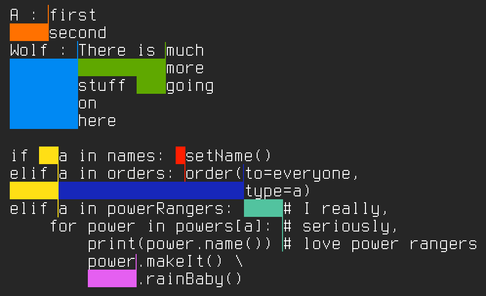

Elastic Alignment
=================

Time for a holy war ! The views expressed here are mine truly
and I am open to fist fights concerning your personal beliefs.

Indenting and aligning code is a very common source of time loss
and holy wars for programmers all over.
Here is a rapid overview of the existing uses of whitespace
to deal with intendation and alignment

* tabs for both — perfectly fine as long as the entire universe
  agrees on tabstop (☹ sadly not at all the case)
  * spaces for both — perfectly fine as long as every editor in the universe
    allows expanding tabs to spaces
    (this is the case for the vast majority of editors that matter,
    ☹ except for Ed, the standard editor)
  * the cost of extra file size caused by spaces galore is negligible
    (this is usually the case, otherwise it is often automatically stripped
    for production, like in web JS)
  * manual realignment is fast/easy (☺ even with visual blocs /
    multiple cursors this is not really the case
    and makes the whole activity of aligninment
    a burden for code maintenance/refactoring)
  * ☹ you don't care about viewers changing tabstop at will
* tabs for indentation and spaces for alignment
  * ☺ reduces file size
  * ☺ allows easy change of tabstop
  * ☹ editors usually aren't efficient at both inserting tabs
    for indentation and expanding them for alignment
  * ☹ This doesn't solve the human cost of alignment
* [elastic tabstops][elastictabstops] by Nick Gravgaard
  * ☺ reintroduces proper usability of proportional fonts for programming !
  * ☺ simple old tabs for everything !
  * partly retrocompatible : all indentation and many kinds of alignments
    will not cause files to look weird in uninitiated editors,
    but wide alignments will make files look disaligned.
    ☹ The success of this depends quite a bit on widespread adoption
  * ☺ alignment becomes a cheap exercise
  * ☹ some formatting rules are needed to avoid messing everything:
    there cannot be a change of indentation and an alignment on the same line
    (C++ style orphan opening brace lines
    or plain empty newlines are recommended,
    which is not the norm in python for example);
    if alignments overlap they must do so perfectly
    (excessive use of alignment is discouraged)

[elastictabstops]: https://www.nickgravgaard.com/elastic-tabstops

What I suggest is some explicit syntax for alignment points.
This would distinguish alignment from indentation,
and also distinguish alignment groups from one another.

I don't know of a good way to encode this using only whitespace,
but I suppose a reasonable one would be with spaces,
where consecutive spaces represent alignment points,
whose unique local identifier is defined by the number of spaces.
This would make alignment look funky in pretty much every noninitiated editor,
and mess with unrelated consecutive spaces (e.g. in strings).

I don't seriously believe this will have real-world impact,
so let's forget about the compatibility issues
and concentrate on the underlying problem.
To this end let's imagine the encoding could be defined
using a new specific Unicode code point,
followed by one byte defining the alignment identifier.

The challenge is to take a file, encoded in such a way,
and display it with proper alignment:
If all the points of an aligned group have the same horizontal position
(when taking into account all the content to their left),
no extra space must be added.
For simplicity this shall be reduced to the monospace case,
where spaces are inserted in the displayed output.
Therefore we can also get away with disregarding tabs for now.

For this challenge we'll just stick to readable ASCII
so let's choose $ as our alignment point,
followed by an alphanumeric character for convenience.
There will be no tabs in the input.

In this example, here are the alignments that act differently
from corresponding elastic tabstops:

* Between the second `$A` and the first `$W`
  there would be no way to avoid tabs placed there to interact.
  * The answer would then be to add an extra line in between,
    which I personally find to be a clunky requirement on the user.
* The second `$a` and the second `$p` would interact,
  the answer would be to add an artificial tab to align to the `$a` one.
  The `$P` on the following line would then interact with that `$a`,
  with no clean fix.
* If the indentations in the last lines were described with tabs,
  they would interact with the last `$c` and with the second `$P`.
  * The answer for the `$c` would once again be to add an extra line.
  * The answer for the `$P` would be to forbid alignment
    across multiple indentation levels
    — it is admittedly a rare occurence and probably a bad pratice altogether
    but once again I don't like adding requirements to the user.

Improvement
-----------

Alignment points were initially supposed to be related if and only if
they were in the same paragraph
(to reduce risk of running out of identifiers).
The implementation, however, is more restrictive and only cares
for blocks of contiguous lines containing the same alignment ID.

This means that the `$W` preceding the `$b` cannot be removed,
or alignment of the subsequent `$W`s with the first one would be lost.
Same thing for the third `$c`.

The solution would be to either align throughout the document
or, as first imagined, by paragraphs. Either would complexify
the design of the implementation, the paragraph-aware one seems
like the cleanest.

Once that's implemented, this would be added to the above list
of “improvements” over elastic tabstops:

* Between the first `$W` and the second `$b`
  you would need to add an intermediary tab to specify the difference.
  That's OK but it seems like an unnecessary exercise.

Conclusion
----------

Elastic tabstops are presented as the perfect answer to a complex situation
but they work only when they are compatible with the programming language
and/or coding style.

This description would solve all corresponding problems
but probably add a slew of implementation and compatibility issues.

The tab war rages on.
